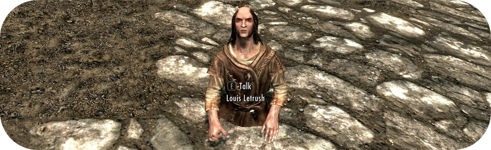
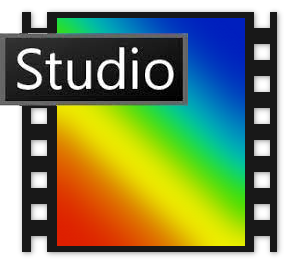
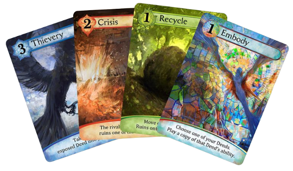

   

# - 🌍 Hello dear traveller 🌌 -

**🪤 > Hi, I'm Dzi4dk, a 20 yo student who loves learning new things and being creative.**

**👨‍🎓 > I am doing engineering studies and I will become an engineer in data science or in software development.**

## - 👨‍🍳 Languages that I learned - 

   
   
   
   

## - 🕵️‍♂️ Languages that I am currently learning -

 

## - 🔧 Tools that I am using -

   
 

## - 🎨 Other tools that I use -

     **- Making visuals and art**   
     **- Creating social network content**

## - 🏗️ My projects -

    

**- Making a Java porting for the Karmaka card game ✔️**   
**- Making a graphical interface for the Karmaka card game 🚧👷‍♂️🚧 (WIP)**   

