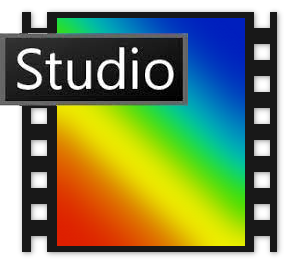

# - 🌍 Hello dear traveller 🌌 -

🪤 > Hi, I'm dzi4dk, a 20 yo student who loves making projects, learning new things and being creative.

👨‍🎓 > I am doing engineering studies and I will become an engineer in data science or in software development.

## - 👨‍🍳 Languages that I learned - 

   
   
   

## - 🕵️‍♂️ Languages that I am currently learning -

 

## - 👨‍🔧Tools that I am using -

   
 

## Other tools that I use

   - Making visuals and art   
   - Creating social network content

